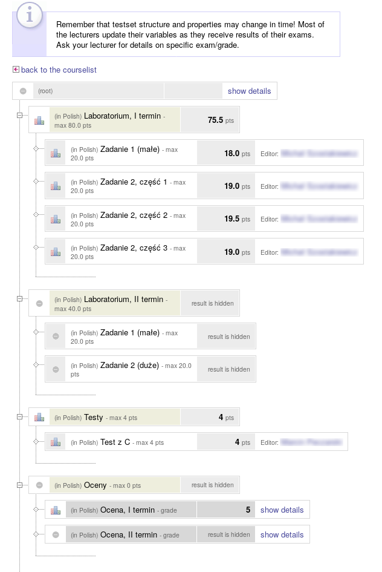
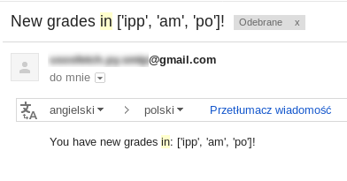

# Usosfetch
A Python script pushing email notifications for grade changes on USOSWeb.

Copyright (C) Mateusz Gienieczko 2018.
Licensed under GNU GPL.

A small Python script I wrote for automatization of USOSWeb checking for new grades.

## Configuration

The script is configured in two places. 

The first one is `config.ini`, which contains HTTP actions for 
logging in and out from the USOSWeb in the AUTHORIZATION group, and then course definitions in GRADES group.
A course definition is a key-value mapping, where the key is an alias for the courses name used in notifications,
and the value is a GET action yielding the grades page from USOSWeb (see images).

The second one is environment variables. The script expects the following environment variables (under `os.environ`):

- `USOS_USERNAME` - login for CAS authorization;
- `USOS_PASSWORD` - password for CAS authorization;
- `RECEIVER_EMAIL` - email to which the notifications will be sent;
- `SMTP_HOST` - url for the SMTP host used to push notifications;
- `SMTP_PORT` - port for the SMTP host used to push notifications;
- `NOTIFIER_USERNAME` - login to a notifier-bot SMTP account;
- `NOTIFIER_PASSWORD` - password to a notifier-bot SMTP account;
- `DATABASE_URL` - connection string to a PostgreSQL database.

## Database

The database has to accessible via psycopg2 (so PostgreSQL). The script expects two tables with names `grades` and `logs` to exist.
The table `grades` has two columns:
- `id` - unique `PK`, not null, `VARCHAR` corresponding to the course definition's key in `config.ini`;
- `list` - not null, `VARCHAR` that represents a JSON list of all grades in the format mentioned below.
The table `logs` also has two columns:
- `id` - unique `PK`, not null, `INT` with auto-increment;
- `log` - not null, `VARCHAR` representing the log. The logs might exceed a couple thousand characters.

## Behaviour

The script is not exactly the smartest. It makes a lot of assumptions about the webpage it's used on
(since my intention wasn't really to use it for anything else than to satisfy my own laziness in checking the 
USOSWeb webpages for my grades). The script performs the following steps:

1. it logs in into USOSWeb via the `LOGIN_POST` action using credentials from the environment variables;
2. it fetches grades for all courses defined in `config.ini` in a form of a list;
3. it fetches the grades from the previous run of the script from the database;
4. it compares the lists for each course and lists all courses for which the lists differ;
5. it pushes a notification containing all differing courses (if it's not empty);
6. it stores the newly fetched grades in the database;
7. it logs out via the `LOGOUT_GET` action.

A sample USOSWeb grades page (the result of a POST specified in course definition) looks like this:




The script (again, not really smart) finds all objects with HTML tag `<td>` and takes data enclosed in tag `<b>` out of it,
since currently the GET returns a HTML file in which all actual points and grades satisfy this and only them. It then produces
a list, e.g.:
```json
[["1.0"], [], ["3.0"]]
```
which corresponds to three grade fields with the first and third one already filled with 1 and 3 points, respectively.

The email sent by the notifier contains all changed courses' IDs, like this:



Logs can be reviewed to investigate the script's behavior. All errors are logged along with the stack-traces in a JSON form:

```json
{
    "2018-09-19 21:35:33.022630": "Log: Begin log session.",
    "2018-09-19 21:35:37.192075": "Log: Login successful.",
    
    // ...

    "2018-09-19 21:35:53.477106": "ERROR: Traceback (most recent call last):\n  File \"C:\\Projects\\usosfetch\\usosfetch\\executor.py\", line 32, in main\n    new_grades = data_manager.get_new_grades()\n  File \"C:\\Projects\\usosfetch\\usosfetch\\data_manager.py\", line 75, in get_new_grades\n    return sorted(list(map(lambda n_t: (n_t[0], self._parse_grade_tree(n_t[1])), self._get_grade_trees())))\n  File \"C:\\Projects\\usosfetch\\usosfetch\\data_manager.py\", line 37, in _get_grade_trees\n    trees.append((name, self._get_grade_tree(url)))\n  File \"C:\\Projects\\usosfetch\\usosfetch\\data_manager.py\", line 27, in _get_grade_tree\n    str(grade_get_result.status_code))\nRuntimeError: Failed to fetch grade data for https://usosweb.mimuw.edu.pl/kontroler.php?_action=dla_stud/studia/sprawdziany/pokaz&wez_id=117291 with code 404\n"
}
```

## Usage

The script is meant to be ran continously, so it is recommended to host the script somewhere in the web and launch
it every 5-10 minutes to have up-to-date info about your grades. It also needs a PostreSQL database connected. The script's execution time depends on connection delays to USOSWeb and the database, and in practice it takes about 20-30 seconds to complete with 4 courses defined (the course GETs seem to take the most time).
